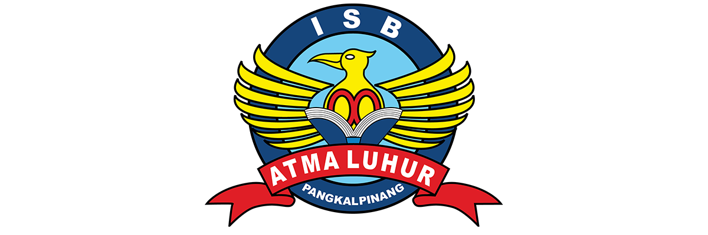

# 2611500058-PWB-26270

Repository Latihan Pertemuan-1 sampai dengan Pertemuan-16  
Mata Kuliah: **Pemrograman Web Dasar**  
Kelompok: **TI1J**  
Program Studi: **Teknik Informatika**  
Tahun Ajaran: **2026/2027 Gasal**  

---

## 👤 Identitas Mahasiswa
* **Nama:** Anggi Kharisma
* **NIM:** 2611500058
* **Kelompok:** TI1J
* **Tahun Ajaran:** 2026/2027 Gasal

---

## 📚 Daftar Progres Pertemuan

| Pertemuan | Topik Materi | Folder | Status |
| :---: | :--- | :---: | :---: |
| **01** | Konsep Dasar Pemrograman Web & Git | [`pertemuan-01`](./pertemuan-01/) | Selesai |
| **02** | HTML Semantik | [`pertemuan-02`](./pertemuan-02/) | - |
| **03** | HTML Form dan CSS Dasar | [`pertemuan-03`](./pertemuan-03/) | - |
| **04** | CSS Layout | [`pertemuan-04`](./pertemuan-04/) | - |
| **05** | JavaScript Dasar | [`pertemuan-05`](./pertemuan-05/) | - |
| **06** | PHP Dasar | [`pertemuan-06`](./pertemuan-06/) | - |
| **07** | PHP Array dan Fungsi | [`pertemuan-07`](./pertemuan-07/) | - |
| **08** | Evaluasi Tengah Semester (UTS) | [`pertemuan-08`](./pertemuan-08/) | - |
| **09** | PHP Lanjutan | [`pertemuan-09`](./pertemuan-09/) | - |
| **10** | PHP dan MySQL | [`pertemuan-10`](./pertemuan-10/) | - |
| **11** | CRUD - Create | [`pertemuan-11`](./pertemuan-11/) | - |
| **12** | CRUD - Update | [`pertemuan-12`](./pertemuan-12/) | - |
| **13** | CRUD - Delete | [`pertemuan-13`](./pertemuan-13/) | - |
| **14** | Session & Cookie | [`pertemuan-14`](./pertemuan-14/) | - |
| **15** | Integrasi Desain | [`pertemuan-15`](./pertemuan-15/) | - |
| **16** | Evaluasi Akhir Semester (UAS) | [`pertemuan-16`](./pertemuan-16/) | - |

---
Repository ini digunakan untuk mendokumentasikan perkembangan pembelajaran mata kuliah Pemrograman Web Dasar dari Pertemuan 1 sampai dengan Pertemuan 16.
